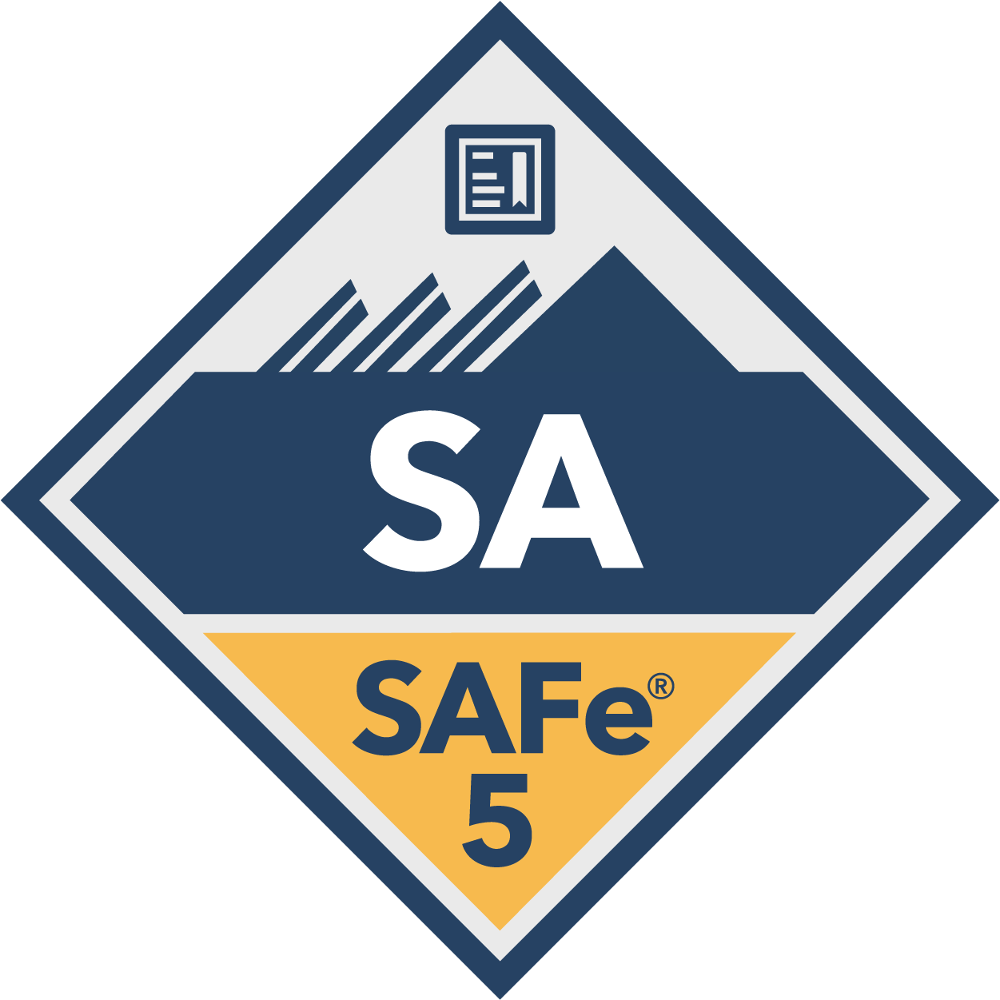



|**Icon/Logo** | **Certificate Name** | **Certificate Organization** | **Date** | **Validity** | **Reference/URL**
| 

 | Certified Tester Foundation Level (CTFL) | ISTQB® - International Software Testing Qualifications Board| Jun-2013 | - | Credential ID 13-CTFL-34362-DE |
| 

 | Professional Scrum Product Owner™ I (PSPO I) | Scrum.org | 8-Mar-2020 | - | <a href="https://www.credly.com/earner/earned/badge/33440c1d-10aa-4e4c-a439-f49548897edf" target="_blank">Credly</a> |
| 

 | Microsoft Certified: Azure Fundamentals | Microsoft | 21-Jun-20 | - | <a href="https://www.credly.com/earner/earned/badge/b265234d-ec34-4268-be1e-08b5d24b501a" target="_blank">Credly</a> |
| 

  | DevOps Foundation® Certification | DevOps Institute | March-2021 | - | Credential ID 22056803 |
| 

 | ITIL 4 Edition | AXELOS Global Best Practice | June-21 | - | Credential ID GR671273001AS |
| 

 | Microsoft Certified: Azure Administrator Associate | [Microsoft](https://www.microsoft.com/){:target="_blank"} | 23-March-2023 | 24-March-2024 | <a href="https://www.credly.com/earner/earned/badge/14537ebe-eaea-4eea-9eee-9213470d3123" target="_blank">Credly</a> |
| 

 | Microsoft Certified: Azure Administrator Associate(renew) | [Microsoft](https://www.microsoft.com/){:target="_blank"} | 24-March-2024 | 25-March-2025 | <a href="https://learn.microsoft.com/en-us/users/schulzartur008-5707/credentials/f9279749bc5d9603?ref=https%3A%2F%2Fwww.linkedin.com%2F" target="_blank">Microsoft</a> |
| 

 | Certified SAFe® 5 Agilist | [Scaled Agile Inc](https://scaledagileframework.com/){:target="_blank"} | 19-August-2021 | 19-August-2021 | <a href="https://www.credly.com/earner/earned/badge/647d2ca4-72cb-4836-a8e5-9ff081931501">Credly</a> |
| 

 | Certified SAFe® 6 Agilist | [Scaled Agile Inc](https://scaledagileframework.com/){:target="_blank"} | 4-April-2023 | 19-August-23 | <a href="https://www.credly.com/badges/bf904b44-ac97-475c-b120-736039a39103" target="_blank">Credly</a> | 
| 

 | ServiceNow Certified System Administrator | [ServiceNow](https://www.servicenow.com/){:target="_blank"} | August-2023 | - | Credential ID 24546654 |